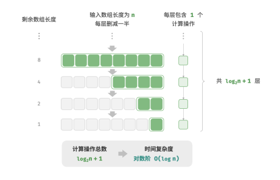
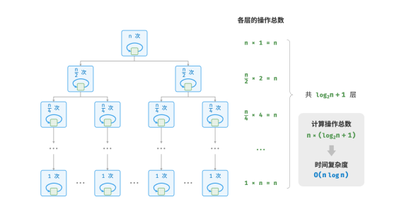

# 复杂度
## 时间复杂度
时间复杂度分析统计的不是算法运行时间，而是算法运行时间随着数据量变大时的增长趋势。

```cpp
// 算法 A 的时间复杂度：常数阶
void algorithm_A(int n) {
cout << 0 << endl;
}
// 算法 B 的时间复杂度：线性阶
void algorithm_B(int n) {
for (int i = 0; i < n; i++) {
cout << 0 << endl;
}
}
// 算法 C 的时间复杂度：常数阶
void algorithm_C(int n) {
for (int i = 0; i < 1000000; i++) {
cout << 0 << endl;
}
}
```
时间复杂度由 𝑇(𝑛) 中最高阶的项来决定。这是因为在 𝑛 趋于无穷大时，最高阶的项将发挥主导作用，其他项的影响都可以忽略。
| 操作数量 𝑇(𝑛) | 时间复杂度 𝑂(𝑓(𝑛))|
|:-:|:-:|
|100000| $𝑂(1)$|
3𝑛 + 2| $𝑂(𝑛)$
$2𝑛^2 + 3𝑛 + 2$| $𝑂(𝑛^2)$
$𝑛^3 + 10000𝑛^2$| $𝑂(𝑛^3)$
$2^𝑛 + 10000𝑛^10000$| $𝑂(2^𝑛)$

设输入数据大小为 𝑛 ，常见的时间复杂度类型:
$𝑂(1)$<$𝑂(logn)$<$𝑂(n)$<$𝑂(n^2)$<$𝑂(2^n)$<$𝑂(n!)$
### 常数阶$𝑂(1)$
```cpp
int constant(int n)
{
    int count = 0;
    for(i=0;i<1000;i++)
        count++;
    return count;
}
```
### 线性阶$𝑂(logn)$
```cpp
int linear(int n)
{
    int count = 0;
    for(i=0;i<n;i++)
        count++;
    return count;
}
```
遍历数组和列表均是线性阶
### 平方阶$𝑂(n^2)$
```cpp
int quadratic(int n) {
int count = 0;
// 循环次数与数据大小 n 成平方关系
for (int i = 0; i < n; i++) {
    for (int j = 0; j < n; j++) {
        count++;
    }
}
return count
```
常用的算法：冒泡排序为平方阶
### 指数阶$𝑂(2^n)$
```cpp
int exponential(int n) {
int count = 0, base = 1;
// 细胞每轮一分为二，形成数列 1, 2, 4, 8, ..., 2^(n-1)
for (int i = 0; i < n; i++) {
    for (int j = 0; j < base; j++) {
        count++;
    }
base *= 2;
}
// count = 1 + 2 + 4 + 8 + .. + 2^(n-1) = 2^n - 1
return count;
}
```
```cpp
// 递归
int expRecur(int n) {
if (n == 1)
    return 1;
return expRecur(n - 1) + expRecur(n - 1) + 1;
```
### 对数阶$logn$
```cpp
/* 对数阶（循环实现） */
int logarithmic(int n) {
int count = 0;
while (n > 1) {
    n = n / 2;
    count++;
}
return count;
}
```
指数阶增长非常迅速，在穷举法（暴力搜索、回溯等）中比较常见。对于数据规模较大的问题，指数阶是不可接受的，通常需要使用动态规划或贪心算法等来解决。


```cpp
//递归实现
int logRecur(int n) {
if (n <= 1)
return 0;
return logRecur(n / 2) + 1;
}
```
对数阶常出现于基于分治策略的算法中，体现了“一分为多”和“化繁为简”的算法思想。它增长缓慢，是仅次于常数阶的理想的时间复杂度。
### 线性对数阶$nlogn$
```cpp
/* 线性对数阶 */
int linearLogRecur(int n) {
if (n <= 1)
    return 1;
int count = linearLogRecur(n / 2) + linearLogRecur(n / 2);
for (int i = 0; i < n; i++) {
    count++;
    }
return count;
}
```


